# APEX — Agent for Personalized Engagement and Experience

**SBI Hackathon (GFF 2026) — Agentic AI for Customer Acquisition, Digital Adoption & Digital Engagement**

> An AI agent that guides new customers to the right SBI products and, once it has their data, becomes an analyser that proactively understands their financial life and intervenes at the right moments — reachable anytime as a financial concierge.

<!-- HERO SCREENSHOT — the customer landing page -->


---

## Table of contents

1. [What APEX is](#1-what-apex-is)
2. [The three modes](#2-the-three-modes)
3. [System architecture](#3-system-architecture)
4. [The backend pipeline](#4-the-backend-pipeline)
5. [Data model](#5-data-model)
6. [Signal catalogue](#6-signal-catalogue)
7. [ML scoring layer](#7-ml-scoring-layer)
8. [The agentic core](#8-the-agentic-core)
9. [Graduated authority model](#9-graduated-authority-model)
10. [Conversational modes](#10-conversational-modes)
11. [The feedback loop](#11-the-feedback-loop)
12. [The customer site — component tour](#12-the-customer-site--component-tour)
13. [The bank ops console — component tour](#13-the-bank-ops-console--component-tour)
14. [API surface](#14-api-surface)
15. [Prototype vs production](#15-prototype-vs-production)
16. [Tech stack](#16-tech-stack)
17. [Running it](#17-running-it)
18. [Repository layout](#18-repository-layout)

---

## 1. What APEX is

Banks already know customers need guidance. What they haven't built is the *next* step: guidance that's personal, conversational, and timed to a real moment in someone's financial life. The core insight behind APEX isn't an architecture choice — it's behavioral: **people don't use the products that already exist for them not because they can't find them, but because need is momentary, jargon is alienating, and financial messages pattern-match to fraud.**

APEX is **one agent with three trigger-gated modes**, sharing one reasoning core, memory, and data layer. It is a **wrapper, not a backend rewrite**: it reasons, explains, and decides; the actual transaction always executes inside SBI's own systems via a deep link. SBI's core banking system stays the sole source of truth — APEX holds only a read-only view for reasoning plus its own audit log of signals, decisions, and outcomes.

The full philosophy in one line: laziness → minimize action; jargon → plain outcomes; vulnerability → restraint; voice-first; language-as-moat.

---

## 2. The three modes

Not three agents. One agent, three modes, gated by **how much data APEX has about the person**.

| Mode | Triggered by | What it does | PS pillar |
|---|---|---|---|
| **Guide** | *Absence* of data — new customer, dormant account, mid-onboarding drop-off | Conversational onboarding & navigation in plain language; hands off real SBI links | Acquisition |
| **Analyser** | *Signals* in existing customer data — transactions, app usage, payment behavior | Detects life moments & product gaps; reaches out proactively (or deliberately waits) | Adoption + Engagement |
| **Concierge** | Customer *initiating* contact, anytime | Answers direct questions from the customer's own real data using read-only tools | Engagement |

**Division of labor:** Analyser mode creates the reason to come back. Guide and Concierge are where the customer actually does something, once they're there.

---

## 3. System architecture

- **Wrapper boundary:** APEX never writes to SBI's core banking system. Every action executes via a deep link on SBI's own page.
- **The seam:** the only simulated thing is the *moment data starts existing* for a customer (the "Simulate 3 months" button). Everything downstream — detection, reasoning, message generation — is real.

<!-- OPTIONAL — replace ASCII above with a polished architecture diagram -->
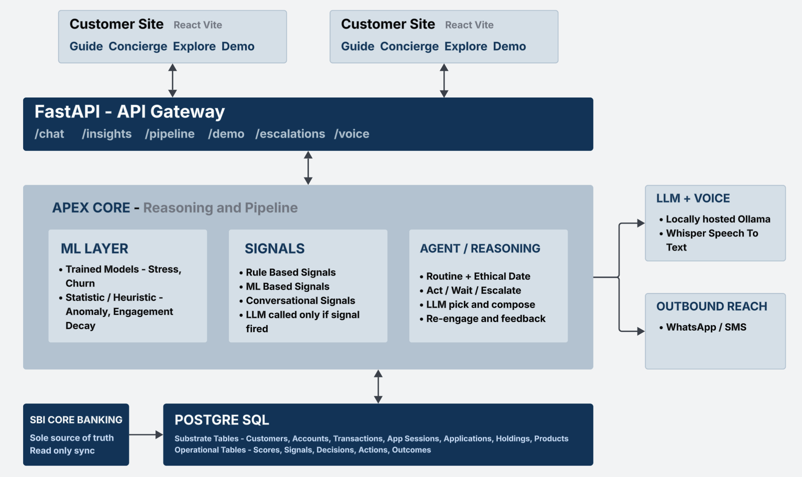

---

## 4. The backend pipeline

The backend is a chain of CLI steps that each write to Postgres. This is the canonical "start clean" order (full commands in **[TESTING.md §1](TESTING.md)**):

```
init_db → generate → train → score → detect → validate → agent loop → (reengage)
```

| Step | Module | Produces |
|---|---|---|
| **init_db** | `apex.database.init_db` | 12 tables + the 28-product catalogue seeded into `PRODUCTS` |
| **generate** | `apex.generator.generate` | 16 hero personas + a noise population of synthetic customers, accounts, transactions, app sessions |
| **train** | `apex.ml.train` | Two models → `artifacts/`: a **stress** model (synthetic) and a **churn/attrition** model |
| **score** | `apex.ml.score` | Per-customer model scores → `SCORES` |
| **detect** | `apex.signals.detect` | Behavioral + model signals → `SIGNALS` |
| **validate** | `apex.signals.validate` | Report card: recall on every persona's expected signal, silence on noise customers |
| **agent loop** | `apex.agent.loop` | One decision per customer → `DECISIONS` + `ACTIONS` (routing + ethical gate + LLM phrasing) |
| **reengage** | `apex.agent.reengage` | Revisits deliberate `wait`s whose acute moment has passed → gentle, product-free insight |

---

## 5. Data model

12 tables (`apex/database/models.py`), split into two groups: the **substrate** (stands in for SBI's CBS — what an internal read feed would provide) and APEX's own **operational audit log** (signals, decisions, outcomes — never a parallel financial ledger).

### 5a. Substrate tables (synced read / synthetic)

**`PRODUCTS`** — the 28-product catalogue.
`product_id` (PK) · `name` · `category` · `depth` (full | reference) · `verified` · `verification_source` · `description` · `eligibility_rules` (JSONB) · `key_facts` (JSONB) · `landing_url` · `primary_use` · `tax_saving`

**`CUSTOMERS`**
`customer_id` (PK) · `name` · `age` · `gender` · `city_tier` (metro\|tier_2\|tier_3\|rural) · `language_pref` · `occupation` · `account_opened_date` · `kyc_status` · `customer_type` (new\|existing\|dormant) · `email` · `monthly_income` · `owns_property` · `dependents` · `owns_gold` · `has_papl_offer` · `has_card_offer`

**`ACCOUNTS`**
`account_id` (PK) · `customer_id` (FK) · `account_type` (FK→products) · `balance` · `opened_date` · `status` (active\|dormant\|closed)

**`TRANSACTIONS`**
`txn_id` (PK) · `account_id` (FK) · `customer_id` (FK) · `amount` · `direction` (debit\|credit) · `merchant_category` · `payee_id` · `channel` (upi\|neft\|cash\|autopay\|card) · `txn_time` · `is_manual_recurring`

**`APP_SESSIONS`**
`session_id` (PK) · `customer_id` (FK) · `login_time` · `duration_seconds` · `features_used` (JSONB) · `device_type`

**`APPLICATIONS`** (onboarding state, incl. drop-offs)
`application_id` (PK) · `customer_ref` (phone/PAN — may precede a customer) · `product_id` (FK) · `started_at` · `last_updated_at` · `current_step` · `steps_completed` (JSONB) · `status` (in_progress\|abandoned\|completed)

**`HOLDINGS`**
`holding_id` (PK) · `customer_id` (FK) · `product_id` (FK) · `units` · `current_value` · `acquired_date`

### 5b. Operational tables (APEX audit log)

**`SCORES`**
`score_id` (PK) · `customer_id` (FK) · `score_type` (stress\|attrition\|engagement_decay\|anomaly) · `value` (JSONB — float or per-category) · `computed_at`

**`SIGNALS`**
`signal_id` (PK) · `customer_id` (FK) · `signal_type` · `source_ref` · `detected_at` · `status` (new\|processed\|expired)

**`DECISIONS`**
`decision_id` (PK) · `customer_id` (FK) · `mode` (guide\|analyser\|concierge) · `trigger_ref` · `hypothesis` · `critique_result` · `confidence` · `outcome` (act\|wait\|escalate) · `product_id` (FK) · `created_at` · `rm_status` (open\|resolved — the escalation queue)

**`ACTIONS`**
`action_id` (PK) · `decision_id` (FK) · `customer_id` (FK) · `authority_level` (1–3) · `channel` (website\|email) · `message_text` · `deep_link` · `sent_at`

**`OUTCOMES`** — the feedback loop
`outcome_id` (PK) · `action_id` (FK) · `customer_id` (FK) · `response_type` (clicked\|dismissed\|ignored\|completed) · `responded_at` · `response_window_closed`

---

## 6. Signal catalogue

Signals are the life-moments and gaps the agent detects (`apex/signals/detectors.py`, routing in `apex/agent/routing.py`). **17 Analyser-mode signals** drive proactive outreach; **1 Guide-mode signal** (`application_dropoff`) drives onboarding resume. Every Analyser signal is routed through eligibility + the ethical gate before any outreach.

### 6a. The 17 Analyser-mode signals

| # | Signal | Meaning | Typical decision |
|---|---|---|---|
| 1 | `idle_balance` | A large sum sitting idle | **act** — sweep / SIP / FD / RD |
| 2 | `dormancy` | Account inactive | **act** — reactivation framing |
| 3 | `manual_recurring_payment` | Same bill paid manually repeatedly | **act** — autopay |
| 4 | `life_event` | Medical / sensitive anomaly | **wait** — *no product push* (restraint) |
| 5 | `cash_flow_stress` | Severe stress (model-scored) | **escalate** (unsecured only) / **act** (secured) |
| 6 | `churn_risk` | Trained attrition-model flag | **escalate** to a human RM (no product) |
| 7 | `salary_credit_upgrade` | Income step-up | **act** — salary package |
| 8 | `sip_graduation` | Ready to graduate to mutual funds | **act** |
| 9 | `fiscal_year_end_window` | Tax-saving window (calendar-gated Jan–Mar) | **act** — 80C / NPS |
| 10 | `large_asset_purchase` | Big-ticket buy detected | **act** — auto loan / general insurance |
| 11 | `login_decay` | App-usage decline | **act** — re-engage (YONO Cash) |
| 12 | `sustained_rent_payment` | Long-run rent pattern | **act** — home loan |
| 13 | `tuition_payment` | Recurring tuition/fees | **act** — education loan |
| 14 | `gold_loan_liquidity_gap` | Owns gold + short-term need | **act** — gold loan |
| 15 | `protection_gap` | No life/accident cover | **act** — ultra-low-cost cover |
| 16 | `preapproved_card_offer` | Pre-approved card eligibility | **act** — credit card |
| 17 | `stated_intent` | Interest the customer voiced in Concierge chat | routed like a behavioral signal |

> **Guide-mode (separate):** `application_dropoff` — KYC/onboarding abandoned → Guide Tier-2 resume (conversational, not a product push; handled in `guide.py`, not the routing map).

### 6b. Signal → product routing map

Each signal proposes an ordered (best-first) candidate list, **branched by what the customer holds/qualifies for**; `is_eligible()` then filters it. The LLM picks the single best fit *within that vetted set* — it can never reach a product not listed here.

| Signal | Candidate products (ordered, pre-eligibility) |
|---|---|
| `idle_balance` | `dep_mod_autosweep` → `inv_jannivesh_sip` → `dep_fd_regular` → `dep_rd` |
| `dormancy` | `acc_insta_plus` (reactivation insight) |
| `fiscal_year_end_window` | holds tax-saver → `inv_nps`; else `dep_tax_saver_fd` → `inv_ppf` |
| `sip_graduation` | `inv_sbi_mutual_fund` |
| `life_event` | `ins_eshield_insta` *(routed, but the gate forces **wait**)* |
| `large_asset_purchase` | `loan_auto` → `ins_general` |
| `manual_recurring_payment` | `pay_epay_autopay` |
| `login_decay` | `pay_yono_cash` |
| `sustained_rent_payment` | `loan_home` |
| `tuition_payment` | `loan_education` |
| `cash_flow_stress` | PAPL offer → `loan_pre_approved_personal`; holds FD → `loan_against_fd`; holds MF → `loan_against_mf`; else `loan_personal` |
| `gold_loan_liquidity_gap` | `loan_gold` |
| `salary_credit_upgrade` | `acc_salary_package` |
| `protection_gap` | `ins_pmjjby` → `ins_pmsby` |
| `preapproved_card_offer` | `card_credit` |
| `stated_intent` | all full-depth products in the category the customer asked about |
| `churn_risk` | *(none — escalates to a human RM)* |

**Eligibility filter (`is_eligible`)** evaluates only the rules APEX can actually check — `min_age`/`max_age`, income floors, `requires_papl_offer`/`requires_card_offer`, `requires_owns_gold`, `requires_dependents`, `requires_existing_fd`, `requires_mf_holdings`, `requires_existing_account`, `requires_new_to_bank`. Unknown rule keys pass through (APEX never fabricates a check it can't honor). The `cash_flow_stress` branching is the key restraint: a severely stressed customer is steered to *secured* lending (against their own FD/MF) or a human, **never** auto-offered unsecured debt.

---

## 7. ML scoring layer

Before any signal can fire, `score.py` turns raw substrate into a few calibrated **scores** per customer, so the agent reasons on "stress = 0.81" instead of raw transactions. **4 scores: 2 trained models + 2 heuristics.**

| Score | Answers | How |
|---|---|---|
| `stress` | Under financial pressure? | **Trained model** (LightGBM→sklearn) on synthetic latent-driver data |
| `attrition` | About to leave the bank? | **Trained model** on real Kaggle churn data |
| `engagement_decay` | Opening the app less? | Heuristic formula over `APP_SESSIONS` |
| `anomaly` | Any transaction weird *for them*? | Heuristic (median + MAD over the customer's own debits) |

**No propensity model — deliberately.** A demographic "people like you tend to want investments" score is exactly the segment-based recommender the philosophy rejects. Product relevance comes from **the signal that fired** (a real present need) and from **`stated_intent`** (what the customer told Concierge they want) — never from inferring desire off a profile.

**Train/serve skew defense.** The *same* feature functions (`features.py`) run at training and serving time, and each `.joblib` artifact stores its own feature list — so a model can never see differently-shaped data in production than it trained on.

**Which scores fire which signals.** Only 5 of the 17 signals read a score; the other 12 are pure raw-data rules:

| Score | Fires | When |
|---|---|---|
| `stress` | `cash_flow_stress` | `stress ≥ 0.80` |
| `anomaly` | `life_event`, `large_asset_purchase` | a *medical*-category anomaly → `life_event`; a retail/vehicle/property anomaly → `large_asset_purchase` |
| `engagement_decay` | `login_decay` | `engagement_decay ≥ 0.30` |
| `attrition` | `churn_risk` | `attrition ≥ 0.80` **and** not already dormant (early warning before the hard `dormancy` line) |

---

## 8. The agentic core

The Analyser is built on one principle — **"code disposes, the LLM proposes"** — and it reasons **per customer, not per signal**, so restraint follows the person and the customer gets *one coherent outreach* instead of a nudge per signal.

```
gather a customer's signals → DECIDE (code gate) → if ACT: pick best fit + compose (LLM) → record
```

The act/wait/escalate call, the eligibility checks, the ethical restraint, and the very *set* of products allowed are **all deterministic code** (`guardrails.py` + `routing.py`). Once code decides to act, the LLM's only job is to **pick the single best-fit product from a pre-vetted safe set and write the message**. It can never reach a product code didn't allow, raise the authority level, or act when code said hold — even under hallucination or prompt injection, the worst case is a different *already-vetted* product or worse copy.

### 8a. `decide_customer` — building the safe set

For one customer, in order (first match wins):

1. **Ethical pre-empt (no LLM):** an active `life_event` (recent medical event) → **whole-customer wait** (APEX holds *all* outreach, not just the medical signal). An active `churn_risk` → **escalate** to a human RM.
2. **Build the safe set:** union the eligible, unheld candidates across every remaining signal, then strip — (a) **insurance + unsecured debt** if the customer is in severe stress (the vulnerability lock); (b) any **category dismissed ≥2×** (back-off); (c) any **product recommended within the last 30 days** (sliding cooldown).
3. **Decide:** nothing eligible → **escalate**; severe stress with *only* unsecured debt left → **escalate** (the Suresh case); everything ethically held back → **wait**; everything on cooldown/dismissed → **wait**; otherwise → **act**. Confidence is derived from how far the driving score sits past its threshold.

### 8b. The ethical gate, in plain words

- **Medical / `life_event` → whole-customer wait.** A recent medical shock silences *all* outreach — not just the medical signal — then `reengage.py` follows up gently once the acute moment has passed.
- **Holistic vulnerability restraint.** Reasoning per customer closes a hole: **Anjali** has both a `life_event` *and* a `protection_gap`; because the vulnerability lock is applied while building the one safe set, insurance simply never enters it. Restraint follows the customer, not the trigger.
- **Severe stress is vulnerable too**, and the lock covers **unsecured debt** (personal loans, cards) but **not secured lending** (loan-against-FD, home, gold). *Suresh vs Lakshmi, both severely stressed:* Suresh's only eligible option is unsecured → stripped → safe set empties → **escalate to a human**; Lakshmi's idle-balance routes to safe savings/secured options → **act**. Same stress, opposite outcome.

### 8c. The LLM step, reengagement, and escalation

- **Pick + compose (one call).** When the gate says ACT, `llm.select_and_compose` gets the vetted safe set (each product tagged with the moment that surfaced it) and returns strict JSON: chosen `product_id`, an internal reason, and the customer message. Code then **validates the pick is in the safe set** (else falls back to the top-ranked option) and computes the authority level from (signal + product). Wait/escalate cases make **zero** LLM calls.
- **Re-engaging a `wait` (`reengage.py`).** A wait is a pause, not a dead end. It revisits *only* `life_event` waits older than `--days` (default 3; demo uses 0), at most once each. Still in severe ongoing stress → keep waiting; moment passed → one product-free, link-free **Level-1 insight** that names nothing sensitive.
- **The escalation queue (`rm_status`).** `escalate` decisions land in a real human-RM inbox (`open → resolved`), surfaced on the ops **Escalations** page — `churn_risk`, severe stress with only unsecured debt, and "nothing eligible."

> **Why no LangGraph for the Analyser:** an earlier `route → hypothesise → critique → decide → compose` graph with self-critique was removed — the critique saw the *same* numbers the code gate already decided on, so it changed nothing. The result is leaner, cheaper, and exactly honest: **code makes every decision and enforces every ethic; the LLM picks the most fitting option and says it well.**

---

## 9. Graduated authority model

The agent never holds open-ended authority. Each action is granted at one explicit level:

- **L1 — Insight only.** No action, zero effort. *"Noticed some larger expenses — want me to check your cushion?"*
- **L2 — One-tap confirm.** Prepares a specific action; the customer's tap on SBI's own page executes it.
- **L3 — Standing rule, set up once.** E.g. auto-sweep idle balance above ₹50k; executes on SBI's infra thereafter.
- **L4 — Autonomous w/ undo window.** *Future state — not built.* Requires scoped write access APEX deliberately doesn't claim yet.

---

## 10. Conversational modes

The Analyser is proactive; Guide and Concierge are **reactive** — the customer starts the chat. Both are **tool-calling agents** (an `agent ⇄ tools` LangGraph loop, capped at `MAX_TOOL_ROUNDS = 4`): the LLM is handed read-only tools and decides which to call, rather than having data stuffed into its prompt.

### 10a. Guide (`guide.py`) — the stranger / drop-off

For prospective customers APEX has **zero** banking data on. Tools: `get_required_documents` (real KYC list per product, from code — never recited), `lookup_application` (live `applications` state — the Tier-2 drop-off check), `list_products`, `get_product_details`. The floor code guarantees: **never invents a URL** (only a product's real `landing_url`), and **never writes to SBI** (no form submission). An anonymous visitor is always a Tier-1 stranger; only an *identified* `customer_id` can be recognised as a Tier-2 drop-off. Pre-filled deep links are deliberately **not** built — that mechanism doesn't work against SBI's real pages, so Tier-2 is an honest reminder + document help + a plain link.

### 10b. Concierge (`concierge.py`) — your own money

For existing customers. Tools: `get_balance`, `get_spending`, `check_affordability`, `get_holdings`, `list_products`, and `recommend_product`. The instruction is blunt: *never guess a number — if a tool gives it to you, use it.* **`recommend_product` applies "code disposes" to Concierge too** — it runs the **same routing + eligibility + ethical guardrails** as the Analyser and returns only vetted products (eligible, not held, ethically cleared). **Safety:** every tool's `customer_id` is injected from the session, **not** the LLM — so Concierge structurally cannot read another customer's money.

### 10c. Concierge feeds the Analyser (`intent.py`)

A customer's *stated* intent is the strongest life-moment signal there is. After each Concierge reply, a background task runs one LLM pass over the conversation:
- **Explicit interest** → a `stated_intent` signal (its `source_ref` = the category) flows through the **same routing + eligibility + ethical gate** as any behavioral signal. *Priya: "I'd like to start investing" → a vetted investment follow-up on the next Analyser run.*
- **Disclosed vulnerability** (job loss, medical crisis, money fear) → APEX creates **nothing** and *expires* any pending `stated_intent`. *Never turn confided distress into a sales trigger.* Even if an intent slipped through, the gate's holistic restraint suppresses it anyway — double protection.

---

## 11. The feedback loop

When a customer engages, APEX captures it in `OUTCOMES` (`agent/feedback.py`): **clicked** (`/track/{id}` logs then redirects to SBI), **dismissed** (`/track/{id}/dismiss`), **ignored** (`/pipeline/expire-outcomes` after N days), **completed** (`/track/{id}/adopt` logs it *and* creates the holding, so the next sweep skips them). Two ways that memory becomes causal:

1. **Product-level cooldown (re-spam suppression).** Building a safe set strips any product recommended within the last **30 days** — a per-(customer, product) *sliding* window read straight from the `DECISIONS→ACTIONS` log (so a product nudged on day 29 can't reappear on day 31). Empty under a full reset (`reset=true` demo mode), active in incremental mode (`/pipeline/agent?reset=false`) — same code, no special-casing.
2. **Category-level back-off.** A per-category dismissal count from `DECISIONS→ACTIONS→OUTCOMES`; the gate strips any category dismissed **≥2×**, so a repeatedly-rejected category is never offered again.

Same idea at two grains: cooldown paces the *same product*; back-off retires a *dismissed category*. Together they also sequence a customer's multiple needs over time — one outreach now, the rest deferred.

---

## 12. The customer site — component tour

**APEX's own website** (`customer/`, React + Vite, `:5174`). Guide, Concierge, Explore, and the demo mechanic live here. Voice (🎤 mic + "Speak replies") works on the Guide and Concierge tabs.

### 12.1 Landing page
The entry surface — "Your money, in plain language."

<!-- customer/src/pages/LandingPage.tsx -->
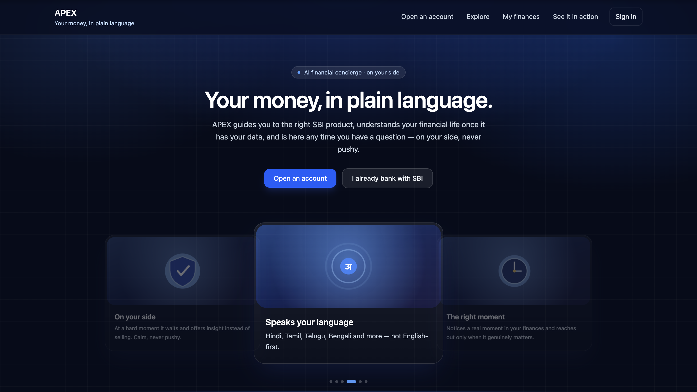

### 12.2 Sign in / resume
Centralized login: a demo profile picker (stands in for SBI SSO), a "resume an unfinished application" path (Tier-2 drop-off), and an "open a new account" entry for true strangers.

<!-- customer/src/pages/LoginPage.tsx -->
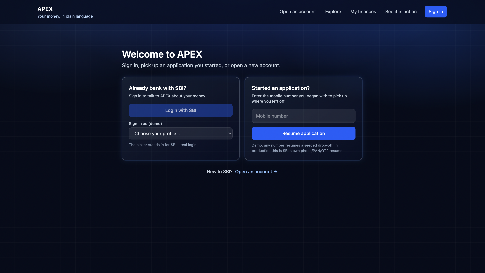

### 12.3 Guide mode — "Open an account"
Tool-calling onboarding agent for someone APEX knows nothing about. Plain language, real document lists pulled by tool, real SBI handoff links, and mirrors the customer's language.

<!-- customer/src/pages/GuidePage.tsx -->
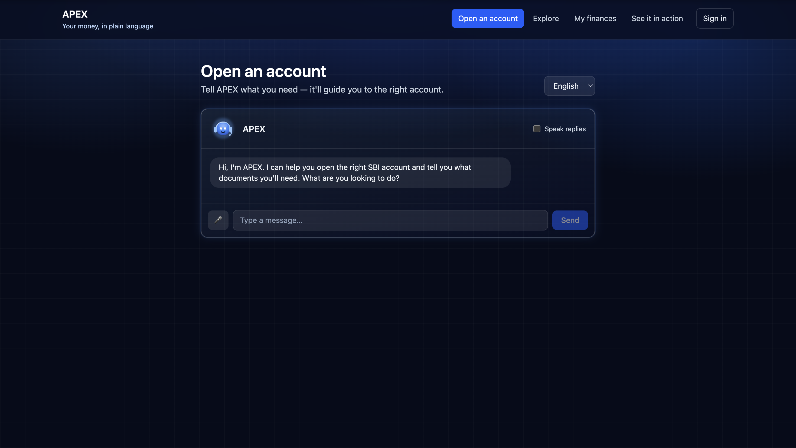

### 12.4 Explore — the catalogue
The full product catalogue grouped by life-need (Save / Grow / Borrow / Protect / Pay) with real links — for the self-directed customer.

<!-- customer/src/pages/ExplorePage.tsx -->
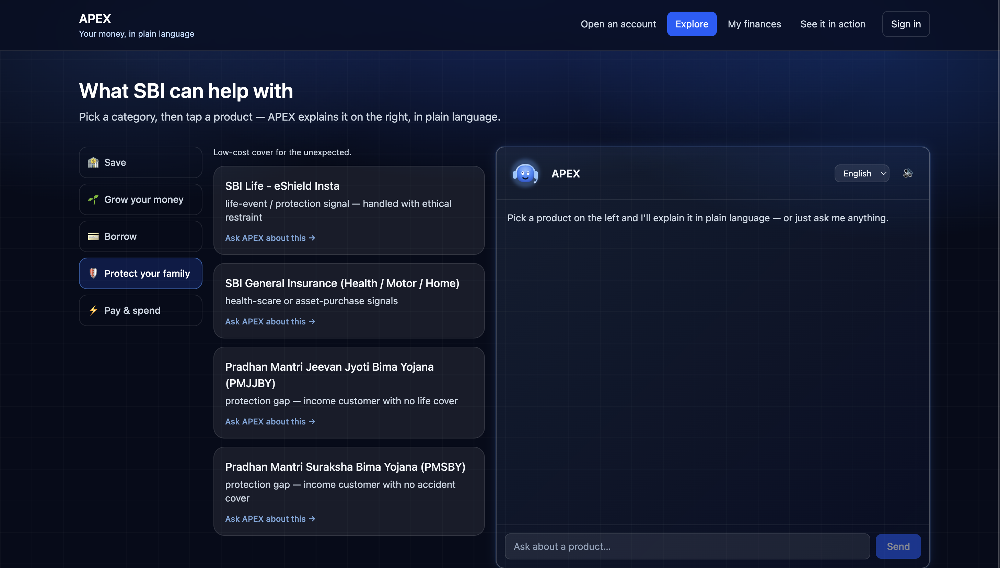

### 12.5 Concierge mode — "My finances"
Answers questions about the signed-in customer's *real* data using read-only tools (it computes, never guesses). Includes the **Financial snapshot** panel, the **"What APEX suggests"** panel (act-decisions with Open / I've done this / Not interested), and the **"Why am I seeing this?"** transparency link that *declines* to elaborate on anything tracing to a vulnerable moment.

<!-- customer/src/pages/ConciergePage.tsx + components/FinancialSnapshot.tsx + ChatPanel.tsx -->
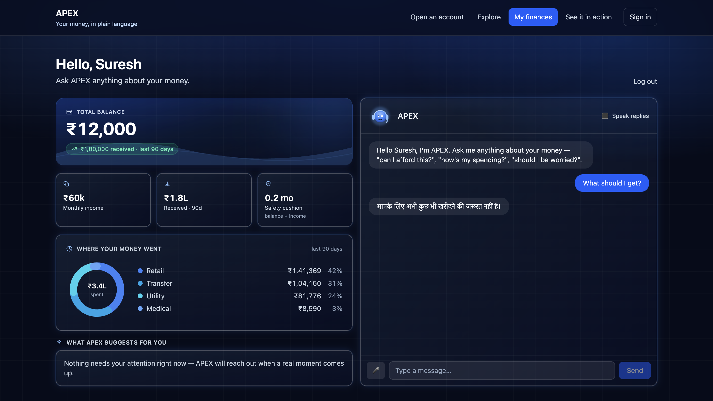

### 12.6 Demo mechanic — "See it in action"
The Guide→Analyser transition, live: pick a scenario, APEX seeds one customer's 3 months and runs score → detect → agent for just them, then shows the outreach. **Lead with the medical scenario** (restraint).

<!-- customer/src/pages/DemoPage.tsx -->
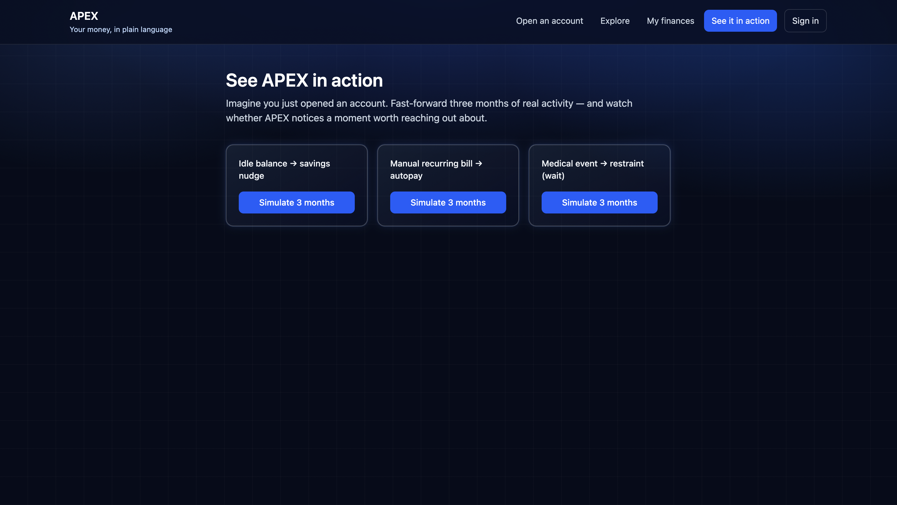

---

## 13. The bank ops console — component tour

The **internal, bank-facing** view (`ops/`, React + Vite, `:5173`) — what the Analyser has done across customers: reasoning traces, decisions, and restraint.

### 13.1 Overview
Signal counts by type, decisions split into act / wait / escalate, an Escalations-open count, plus **Run pipeline** and **Re-engage waits** controls.

<!-- ops/src/pages/Overview.tsx -->
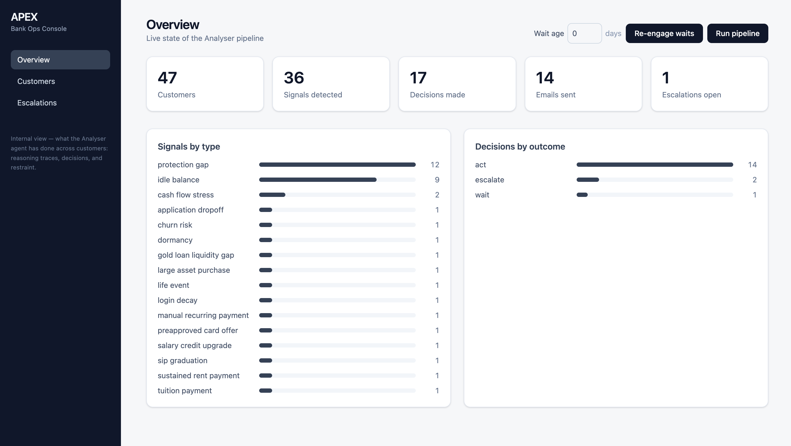

### 13.2 Customers
Everyone with their signals and outcomes in one table.

<!-- ops/src/pages/Customers.tsx -->
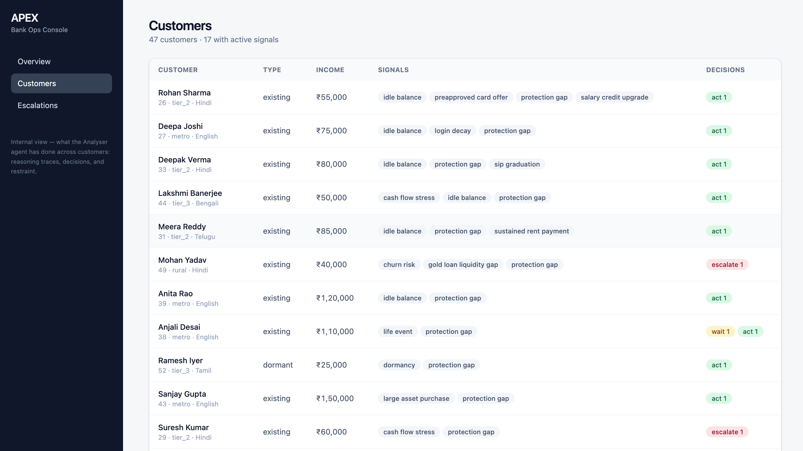

### 13.3 Customer detail — the reasoning trace
The money shot. Open **Anjali Desai** (`life_event` → **wait**): APEX *detected* the vulnerability and *chose to hold all outreach* — the LLM was never called, the decision is logged as `wait` with the `[gate]` reason. Restraint enforced in code, visible in the trace.

<!-- ops/src/pages/CustomerDetail.tsx -->
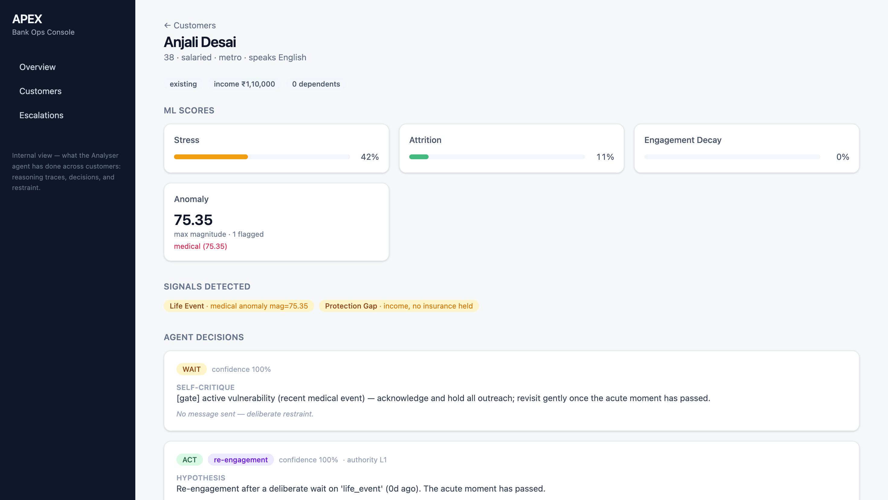

### 13.4 Escalations — the human RM handoff
`escalate` decisions land in a human relationship-manager inbox (e.g. Suresh Kumar — severe stress + only unsecured debt; churn-risk cases). Each card shows the gate's reason; **Mark handled** clears it.

<!-- ops/src/pages/Escalations.tsx -->
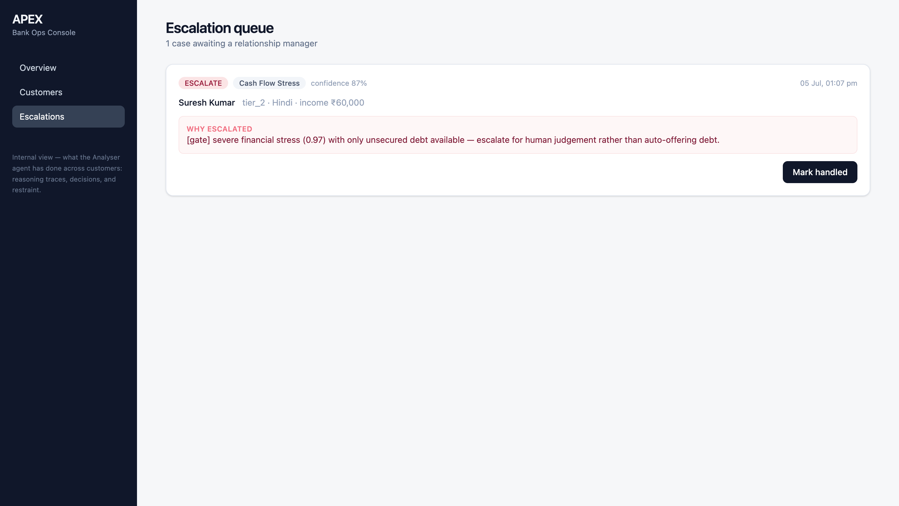

---

## 14. API surface

FastAPI (`apex/api/app.py`), served at `:8000` with interactive docs at `/docs`. It holds **no business logic** — a thin layer that calls the pipeline/agent/conversation modules and serializes the result (`serializers.py`: UUID→string, Decimal→float, datetimes→ISO). Key endpoints:

| Endpoint | Purpose |
|---|---|
| `GET /health` · `GET /stats` | Liveness + customer/signal/decision counts |
| `GET /customers` · `GET /customers/{id}` | Roster + per-customer signals/decisions/outcomes |
| `GET /products` | The 28-product catalogue |
| `GET /insights/{id}` | Money-at-a-glance + suggestions (each with a `why_url`) |
| `GET /explain/{action_id}` | "Why am I seeing this?" (declines on sensitive triggers) |
| `POST /chat` | Guide / Concierge tool-calling chat |
| `POST /voice/transcribe` | Groq Whisper STT |
| `GET /escalations` · `POST /escalations/{id}/resolve` | RM queue + mark handled |
| `POST /pipeline/{score,detect,agent,reengage,run-all}` | On-demand pipeline triggers |
| `GET /demo/scenarios` · `POST /demo/simulate` | The "Simulate 3 months" mechanic |
| `GET /track/{action_id}/{adopt,dismiss}` | Feedback-loop outcome capture |

---

## 15. Prototype vs production

The guiding rule: **simulate the plumbing, keep the brain real.** Every "simulated" row below is a seam where SBI's own infrastructure would hand APEX something (a data event, a login token) — never a seam where APEX's reasoning or judgment is faked.

| Concern | Prototype (built) | Production |
|---|---|---|
| Data source | Synthetic generator | Continuously-synced read-only view of SBI's CBS (read replica / curated feed) |
| Data arrival | One-shot batch insert | **Automatic replication keeps the read view fresh — sufficient on its own.** Streaming (Kafka/webhooks) only if APEX holds its own store: transport, never triggers reasoning |
| Cadence | On-demand, recompute fresh | Nightly sweep (Analyser) + on-demand live reads (Concierge/Guide) |
| Dedup | Wipe & recompute | Incremental: signal lifecycle + cooldown + back-off |
| Models | Stress (synthetic) + churn (real Kaggle) | Periodic retraining + drift monitoring |
| LLM inference | Groq (free tier) | Self-hosted Ollama (data never leaves SBI) |
| Outbound channel | Real email to a sink (Resend) | WhatsApp / SMS |
| Authentication | "Sign in as" picker | Real SSO handoff from SBI |
| Authority L4 | Not built (future state) | Requires SBI-granted scoped write access |
| Scale | One process, ~46 customers, in memory | Millions → distributed queues + prioritisation |

What APEX **never fakes**, even now: the reasoning (real LLM + code gate), the ethics, the voice pipeline (Whisper STT), and one real outbound channel (email). *"Everything that's hard — the reasoning, the judgment, the restraint — is fully real. The only things simulated are the handful of seams where real bank integration isn't possible at hackathon scale: data arriving, time passing, and login."*

---

## 16. Tech stack

- **Backend:** Python · FastAPI · SQLAlchemy · Postgres · LightGBM/scikit-learn (stress + churn models)
- **Agent:** LLM tool-calling (Guide/Concierge) + code-gated select-and-compose (Analyser); deterministic fallback when no key — a dead LLM never breaks the pipeline
- **Voice:** Whisper (STT) + browser TTS — no telecom needed
- **Frontends:** React + Vite + TypeScript + Tailwind — two apps (customer `:5174`, ops `:5173`)

> **Demo runs on:** Groq (LLM + Whisper free tier), Resend (real email to a sink). **Production target:** self-hosted Ollama for inference, WhatsApp/SMS for outbound (see §15). The reasoning and voice pipeline are fully real either way — only the delivery channel and inference host differ.

---

## 17. Running it

Full copy-paste instructions are in **[TESTING.md](TESTING.md)**. The short version:

```bash
# 1. Rebuild the data + reasoning (backend/, venv active)
python -m apex.database.init_db
python -m apex.generator.generate --reset
python -m apex.ml.train && python -m apex.ml.score
python -m apex.signals.detect && python -m apex.signals.validate
python -m apex.agent.loop

# 2. Serve (three terminals)
uvicorn apex.api.app:app --reload --port 8000   # API + /docs
cd ops && npm run dev                            # dashboard  :5173
cd customer && npm run dev                       # customer   :5174
```

Then exercise every mode following **[TESTING.md](TESTING.md)**.

---

## 18. Repository layout

```
APEX/
├── README.md            ← you are here (system + visual tour)
├── TESTING.md           ← reset + rebuild + test every mode
├── product_catalogue.json
├── docs/img/            ← screenshots referenced above
├── backend/             ← FastAPI + pipeline (apex/ package)
│   └── apex/
│       ├── database/    ← models, init, seed
│       ├── generator/   ← personas + synthetic data
│       ├── ml/          ← train / score / features
│       ├── signals/     ← detect / validate / thresholds
│       ├── agent/       ← routing, guardrails, guide, concierge, loop, mailer, voice
│       ├── api/         ← FastAPI app + serializers
│       └── demo.py      ← "Simulate 3 months" mechanic
├── customer/            ← customer-facing React app (:5174)
└── ops/                 ← bank ops console React app (:5173)
```

---

**APEX** — knows when to act, when to wait, and when to step back.
